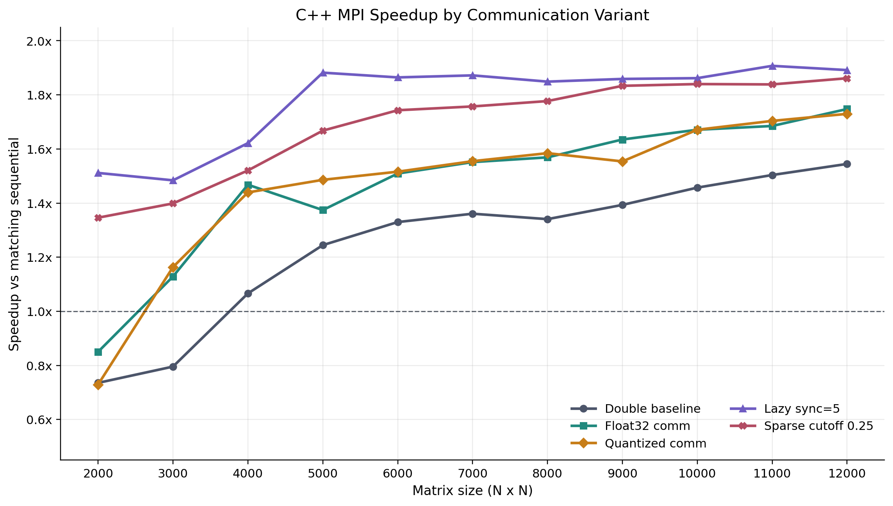
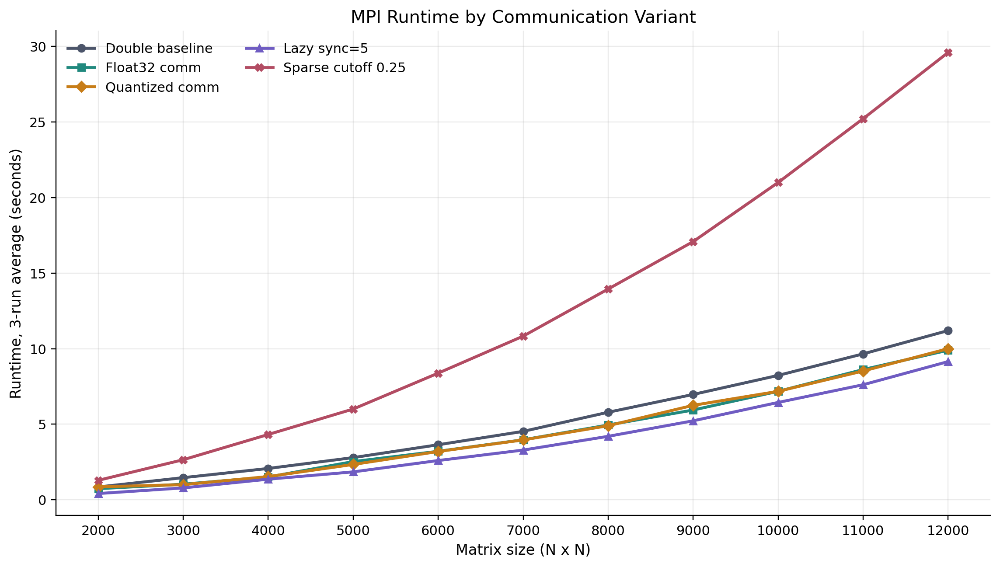
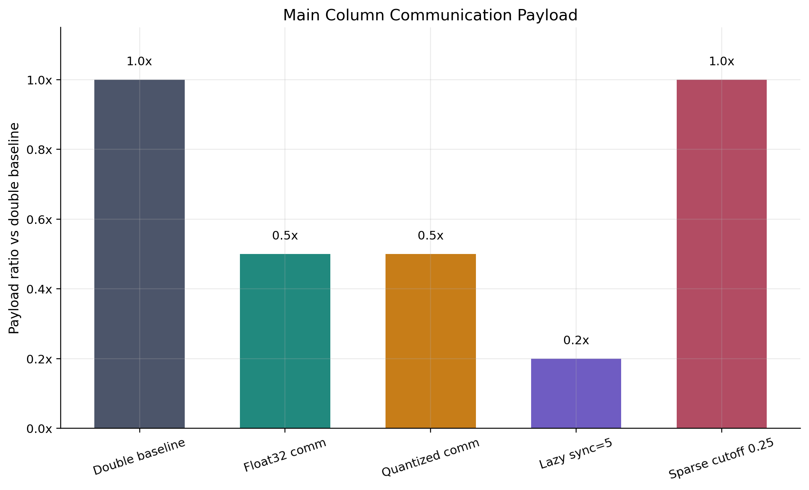
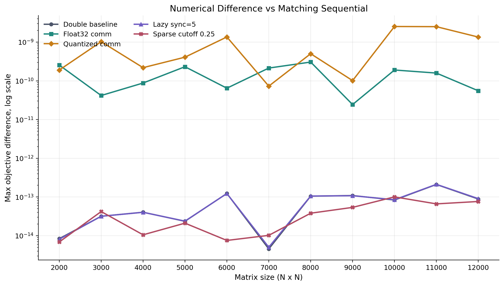
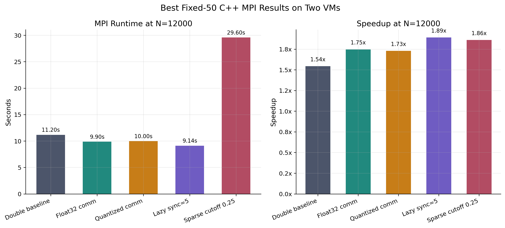
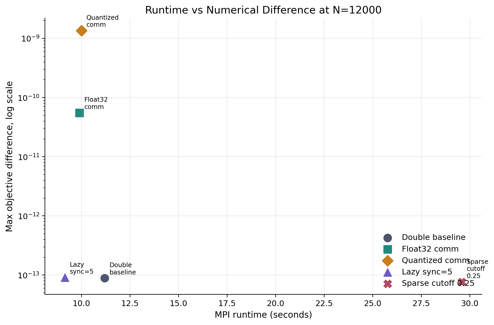
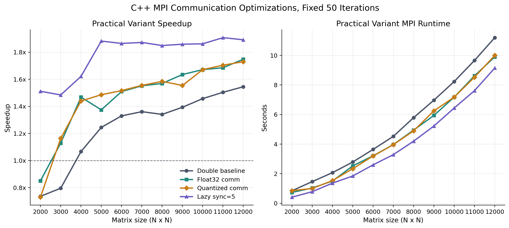

# Benchmark Charts

Generated from `summary_by_variant_avg3.csv`. PNG and SVG versions are available in `charts/`.

## Speedup

## MPI Runtime

## Payload Ratio

## Objective Difference

## Size 12000 Summary

## Runtime vs Accuracy

## Practical Variants Only

